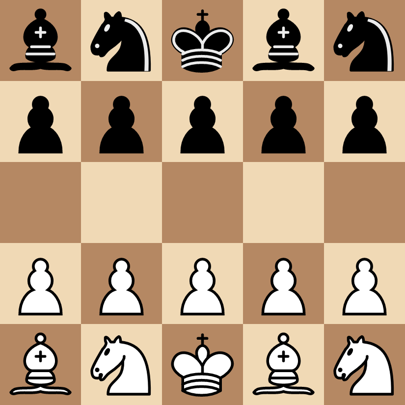

# MiniAlpha

## Overview
MiniAlpha is an AI program designed to play chess on a 5x5 board with the following starting position:

Pawn double-moves and en-passant capture are prohibited. All other rules are identical to regular chess.
